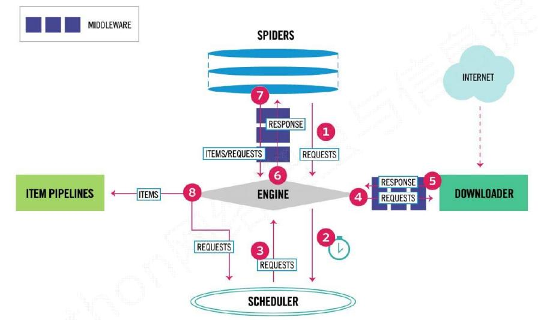

# LB-Adapt scrapy application
Collect structured data from Adapt website. A web crawler that will visit Adapt website. Fetch html pages, 
parse them in the desired format and save them in JSON file.


# Architecture of my Application:

 

1. The **Spider** throws the initial request to the **Engine** to start crawling.
2. The **Engine** schedules the request in the **Scheduler** and asks for the next request to crawl.
3. The **Scheduler** throws back the request to the **Engine**.
4. The **Engine** sends the request off to the **Downloader**, where the request passes through the **Downloader Middleware**.
5. After the request finishes downloading, the **Downloader** generates a response, it sends it back to the **Engine** through the **Downloader Middleware**
6. After getting the response from the **Downloader**, the **Engine** returns the response to the **Spider** through the Spider **Middleware**.
7. The **Spider** processes the response and scrapes the required items, and the new request for crawling back to the **Engine**, again passing through the **Spider Middleware**.
8. The **Engine** sends the scraped items to the **Items** (also known as **Item Pipeline**) and then sends the processed requests to the **Scheduler** and asks for the next request to crawl.
9. This processes (step-1 to step-8) repeats until no requests are left in the **Scheduler** for crawling.

**Project Skeleton:**
```tree
.
├── adapt
│   ├── adapt
│   │   ├── __init__.py
│   │   ├── items.py
│   │   ├── middlewares.py
│   │   ├── pipelines.py
│   │   ├── settings.py
│   │   └── spiders
│   │       ├── adapt_apider_company_profiles.py
│   │       ├── adapt_spider_company_index.py
│   │       └── __init__.py
│   ├── data
│   │   ├── architecture.png
│   │   ├── company_index.json
│   │   ├── company_profile.json
│   │   └── lbadaptDB.sql
│   └── scrapy.cfg
├── README.md
└── requirements.txt

4 directories, 15 files
```

**All scrape data you can find here:** 
1. [Company index data](adapt/data/company_index.json)
2. [Company profiles data](adapt/data/company_profile.json)

**Company index data format:**
```json
[
    {
        "company_name":"A&A Technology Group",
        "source_url":"https://www.adapt.io/company/a-a-technology-group",
        "tag":"https://www.adapt.io/directory/industry/telecommunications/A-1"
    },
    {
        "company_name":"A Better Answer",
        "source_url":"https://www.adapt.io/company/a-better-answer-4",
        "tag":"https://www.adapt.io/directory/industry/telecommunications/A-1"
    },
    {
        "company_name":"A Cheerful Giver",
        "source_url":"https://www.adapt.io/company/a-cheerful-giver-inc-1",
        "tag":"https://www.adapt.io/directory/industry/telecommunications/A-1"
    },
    {
        "company_name":"A-CTI",
        "source_url":"https://www.adapt.io/company/a-cti-1",
        "tag":"https://www.adapt.io/directory/industry/telecommunications/A-1"
    }
]
```
**Company profiles data format:**
```json
[
    {
        "Company_name":"Argosy Communication Products Ltd.",
        "Company_location":"Victoria, BC, Canada",
        "Company_website":"http://www.acpltd.ca",
        "Company_webdomain":"acpltd.ca",
        "Company_industry":"Telecommunications",
        "Company_employee_size":"0 - 25",
        "Company_revenue":null,
        "contact_details":[
            {
                "contact_name":"Gerry Wight",
                "contact_jobtitle":"Director of Sales",
                "contact_email_domain":"@acpltd.ca",
                "contact_department":"Director of Sales"
            }
        ]
    },
    {
        "Company_name":"Access Point, Inc.",
        "Company_location":"Cary,  North Carolina, United States",
        "Company_website":"http://www.gtt.net",
        "Company_webdomain":"gtt.net",
        "Company_industry":"Telecommunications",
        "Company_employee_size":"100 - 250",
        "Company_revenue":"$10 - 50M",
        "contact_details":[
            {
                "contact_name":"Candice Lane",
                "contact_jobtitle":"Order Assurance Specialist",
                "contact_email_domain":"@accesspointinc.com",
                "contact_department":"Order Assurance Specialist"
            },
            {
                "contact_name":"Jack Erdman",
                "contact_jobtitle":"Credit and Collections Manager",
                "contact_email_domain":"@accesspointinc.com",
                "contact_department":"Credit and Collections Manager"
            }
        ]
    }
]
```

# Which database engine I choose and why?

1. I chose **MySQL database**.
2. Why?
    - **Scalability and Flexibility:** The MySQL database server provides the ultimate in scalability, sporting the capacity to handle deeply embedded applications 
    - **High Availability:** A unique storage-engine architecture allows database professionals to configure the MySQL database server specifically for particular applications, with the end result being amazing performance results.
    - **Web and Data Warehouse Strengths:** MySQL is the de-facto standard for high-traffic web sites because of its high-performance query engine, tremendously fast data insert capability, and strong support for specialized web functions like fast full text searches. 
    - **Comprehensive Application Development:** One of the reasons MySQL is the world's most popular open source database is that it provides comprehensive support for every application development need.
